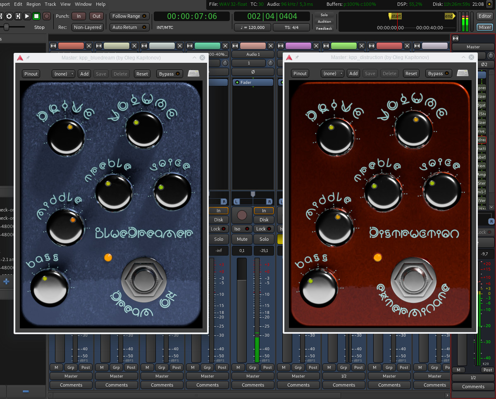

Kapitonov Plugins Pack (KPP)
============================

Last release is 1.1.

> Set of plugins for guitar sound processing.
> Compatible with hosts such as Ardour, Qtractor, Carla, 
> guitarix, jack-rack.

Binary files are available for Linux 64-bit systems.
Source code can be compiled for Linux 64-bit or 32-bit.
Windows versions are planned for the future.

### Currently available plugins

1. tubeAmp.
   Advanced guitar tube amp emulator. Contains preamp,
   tonestack, power amp with voltage sag, cabinet emulators.
   Emulation parameters of each component are set by profile files.
2. Bluedream.
   Booster/Tube Screamer pedal with equalizer (tonestack).
   Has GUI
3. Distruction.
   Distortion pedal with equalizer (tonestack).
   Has GUI.
4. Fuzz.
   Vintage fuzz pedal.
   Has GUI.
5. Deadgate.
   Effective Noise Gate/Dead Zone effect plugin.
6. Octaver.
   Analog octaver pedal.
7. Single2Humbucker.
   Plugin for emulation humbucker pickup sound with
   single coil pickup on the guitar. Useful for playing 
   heavy-metal on Stratocaster guitar with single coil pickups.

This plugins (except tubeAmp) available in LV2 and LADSPA versions. It is
strongly recommended to use LV2 versions. LADSPA versions
are mainly intended for use with guitarix.
 
tubeAmp is the main and most complex plugin in the set.
It can be used to emulate the sound of any common models 
of guitar combo amplifiers.

Four *.tapf profiles for tubeAmp available in this release.
Tool set for creation and editing *.tapf profiles will
be available later.

### IMPORTANT!!!

The input level at the beginning of the plugins chain should be -20 dB!
You can use plugins like https://github.com/x42/meters.lv2 to measure 
and adjust the signal level.

### Dependencies for using

1. LV2 or LADSPA compatible host on Linux operating system.
   It can be Ardour, Qtractor, Carla,
   or guitarix with LADPSA versions.
   VST versions for Windows are planned for the future.
2. Cairo library for GUI.
3. Zenity for File Select dialog (for profile changing in tubeAmp).
4. Zita-resampler 1.6 and zita-convolver 4.0 libraries.

### Dependencies for building

1. g++ compiler.
2. Meson build system.
3. Cairo library development files (headers, pkg-info).
4. Boost development files.
5. Zita-resampler 1.6 development files.
6. Zita-convolver 4.0 development files.
7. LV2 or LADSPA development files.
8. Faust 2.x compiler and libraries.

### How to build and install

Project now uses meson build system (thanks to [cyclopsian](https://github.com/cyclopsian))

1. Run `meson build` and then `ninja -C build` in the source directory.
2. Run `ninja -C build install` to install to /usr/lib/ladspa and /usr/lib/lv2.
   To install to your user directory, run
  `meson build --reconfigure -Dladspadir=~/.ladspa -Dlv2dir=~/.lv2` and then
  `ninja -C build install`.
3. Launch host application (e. g. Ardour). Find desired plugin 
   in the library. Names will have `kpp_` prefix.
4. If your distribution has old versions of zita-resampler and zita-convolver,
   use 'thirdparty-included' branch instead of 'master'.

### How to install binary versions

1. For Debian Buster (10) download KPP-1.1-binary-debian10.tar.bz2.
2. For Ubuntu LTS and other distributions download KPP-1.1-binary-ubuntu-bionic.tar.bz2.
3. Copy LV2 bundle or LADSPA .so file to the proper place in your system,
   which is in the plugins PATH for your host application. Usually it is
   `/usr/lib/lv2` for LV2 plugins and `/usr/lib/ladspa` for LADSPA plugins.
4. Launch host application (e. g. Ardour). Find desired plugin in library,
   names will have `kpp_` prefix.

### Quick start guide

[English](https://github.com/olegkapitonov/Kapitonov-Plugins-Pack/blob/master/guide.md)

[Русский](https://github.com/olegkapitonov/Kapitonov-Plugins-Pack/blob/master/guide_ru.md)

 
## Development

DSP code is written in Faust language. GUI and support code is written in C and C++
with Cairo library for rendering and Xlib library for low-level
operations.

## License

GPLv3+.
